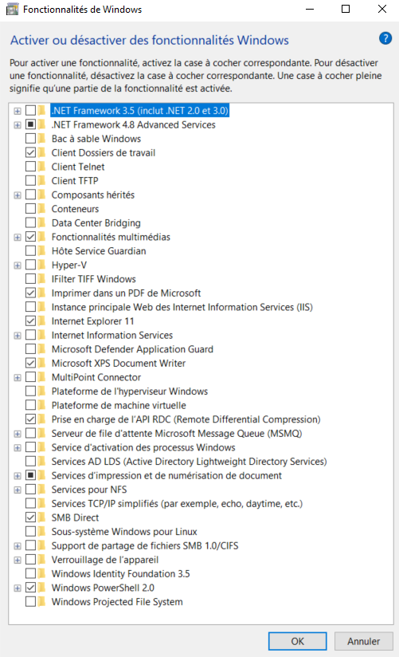

# DevOps Lab

Bienvenue dans ce **LAB** d’initiation aux pratiques **DevOps** !  

> 🎯 L'objectif de la plateforme est de pouvoir pratiquer les concepts **DevOps** directement sur ta machine en local sans avoir à payer des ressources auprès des fournisseurs Cloud.

---

⚠️ **IMPORTANT** :  
**LES IMAGES DOCKER DE CE LAB SONT RÉSERVÉES À DES FINS DE TEST ET D’APPRENTISSAGE UNIQUEMENT !**  ➡️ **NE PAS LES UTILISER DANS UN  ENVIRONNEMENT DE PRODUCTION.**

---

## Et c'est quoi DevOps ?

- **Une culture de collaboration** entre développeurs (Dev) et opérations (Ops) pour briser les silos et travailler vers un objectif commun : la livraison rapide et fiable de logiciels (produits).
- **Des pratiques d'automatisation** (CI/CD, tests, déploiement, supervision) pour améliorer la qualité, la fréquence et la sécurité des mises en production.
- **Une démarche d’amélioration continue** fondée sur le feedback rapide, la mesure des performances, et l’adaptation permanente aux besoins des utilisateurs.


**Les outils à disposition dans ce lab :**

- `Docker` : Outil de conteneurisation.
- `Kubernetes (k3s)` : Outil d'orchestration des conteneurs.
- `Ansible` :  Outil de configuration et déploiement.
- `Terraform` : Outil d'automatisation de la création d’infrastructure.

---


## ✅ Pré-requis 

**Ce dont tu auras besoin :**

- Un ordinateur portable avec au moins 8 Go de RAM (16 Go est préférable)
- Environ 50 Go d'espace disque de disponible
- Un système d'exploitation Windows, MacOS, ou Linux
- Etre administrateur de l'ordinateur portable
- L'option de Virtualisation doit être activé dans le BIOS
- un accès à internet
- Quelques heures de disponibilité pour pratiquer

---

## **Avant de commencer sur `WINDOWS` :**  

- [Installes chocolatey](https://chocolatey.org/install)

Lances `PowerShell` en tant qu'administrateur puis executes : 

```bash
Get-ExecutionPolicy
```
Si la commande retourne `Restricted` alors executes : 

```bash
Set-ExecutionPolicy AllSigned
```

Puis executes : 

```bash
Set-ExecutionPolicy Bypass -Scope Process -Force; [System.Net.ServicePointManager]::SecurityProtocol = [System.Net.ServicePointManager]::SecurityProtocol -bor 3072; iex ((New-Object System.Net.WebClient).DownloadString('https://community.chocolatey.org/install.ps1'))
```

En cas d’erreur penses à desactiver l’antivirus.

Si pas des erreurs alors tu es prêt à utiliser Chocolatey, pour s'assurer le bon fonctionnement executes la commande ci-dessous afin de voir la version installée : 

```bash
choco
```

- [Installes virtuallbox](https://community.chocolatey.org/packages/virtualbox)

Lances `PowerShell` en tant qu'administrateur puis executes : 

```bash
choco install virtualbox --version=7.1.4 -y 
```

- [Installes vagrant](https://community.chocolatey.org/packages/vagrant)

Lances `PowerShell` en tant qu'administrateur puis executes : 

```bash
choco install vagrant --version=2.4.5 -y 
```

- [Installes git](https://community.chocolatey.org/packages/git)

Lances `PowerShell` en tant qu'administrateur puis executes : 

```bash
choco install git -y
```

- [Installes Visual Studio Code](https://community.chocolatey.org/packages/vscode)

Lances `PowerShell` en tant qu'administrateur puis executes : 

```bash
choco install vscode -y 
```

- [Installes Helm](https://community.chocolatey.org/packages/kubernetes-helm)

Lances `PowerShell` en tant qu'administrateur puis executes : 

```bash
choco install kubernetes-helm --version=3.17.2 -y
```


- [Installes kubectl](https://community.chocolatey.org/packages/kubernetes-cli)

Lances `PowerShell` en tant qu'administrateur puis executes : 

```bash
choco install kubernetes-cli --version=1.33.0 -y 
```

Pour tester executes : 

```bash
kubectl version --client
```

Pour plus d'information concernant l'autocompletion des commandes kubectl, consultes la documentation [ici](https://kubernetes.io/docs/reference/kubectl/quick-reference/#kubectl-autocomplete).

**Pour faire de la virtualisation sur ta machine, penses à l’activer dans le bios et desactiver les autres outils de virtualisation dans les fonctionnalités Windows :**  

*`
Hyper-V,
Sous-sytème Windows pour Linux,
Docker Desktop,
Plateforme de machine virtuelle, 
Plateforme de l’hyperviseur Windows.
`*



---

## **Avant de commencer sur `MacOS` :**  

- [Installes Homebrew](https://brew.sh/fr/)

Ouvres une fenêtre du `Terminal` et executes : 

```bash
/bin/bash -c "$(curl -fsSL https://raw.githubusercontent.com/Homebrew/install/HEAD/install.sh)"
```
Le script explique ce qu’il va faire, puis fait une pause avant de l’exécuter. Plus d’options d’installation sont disponibles [ici](https://docs.brew.sh/Installation).


Après l'instaion d'Homebrew crées un fichier dans le repertoire personnel de ton utilisateur nommé .curlrc avec comme contenu "-k" :

```bash
echo-k > ~/.curlrc
```

```bash
cat ~/.curlrc
```

- [Installes virtualbox (Ne pas faire pour MacOS M1/M2)](https://formulae.brew.sh/cask/virtualbox#default)

Ouvres une fenêtre du `Terminal` et executes : 

```bash
brew install --cask virtualbox
```

- [Installes vagrant](https://formulae.brew.sh/cask/vagrant#default)

Ouvres une fenêtre du `Terminal` et executes : 

```bash
brew install --cask vagrant
```

```bash
brew install --cask vagrant-manager
```

- [Installes git](https://formulae.brew.sh/formula/git#default)

Ouvres une fenêtre du `Terminal` et executes : 

```bash
brew install git
```

- [Installes Visual Studio Code](https://formulae.brew.sh/cask/visual-studio-code#default)

Ouvres une fenêtre du `Terminal` et executes : 

```bash
brew install --cask visual-studio-code
```

**`Les installations ci-dessous concernent uniquement les MacOS M1/M2`** :

- [Installes rosetta (Pour MacOS M1/M2)](https://techcommunity.microsoft.com/blog/intunecustomersuccess/support-tip-install-rosetta-2-on-new-apple-silicon-m1-macs-to-run-apps-built-for/2087631)

Ouvres une fenêtre du `Terminal` et executes : 

```bash
/usr/sbin/softwareupdate --install-rosetta --agree-to-license
```

Crées un compte sur le site de [Broadcom](https://profile.broadcom.com/web/registration) afin de pouvoir telecharger et installer VMWare Fusion Tech Preview :

**`VMware Cloud Foundation => My Downloads => VMware Fusion => VMware Fusion 13 Pro Personal Use => 13.6 => Download`**

VMware Fusion/Pro 13 License Keys, uniquement pour les tests :

```bash
4A4RR-813DK-M81A9-4U35H-06KND
NZ4RR-FTK5H-H81C1-Q30QH-1V2LA
4C21U-2KK9Q-M8130-4V2QH-CF810
MC60H-DWHD5-H80U9-6V85M-8280D
JU090-6039P-08409-8J0QH-2YR7F
4Y09U-AJK97-089Z0-A3054-83KLA
```

*`Penses à autoriser VMware Fusion dans la sécurité d'accessibilité et les paramètres de confidentialité de ton Mac.`*

- [Installes vagrant VMware](https://formulae.brew.sh/cask/vagrant-vmware-utility#default)

Ouvres une fenêtre du `Terminal` et executes : 

```bash
brew install --cask vagrant-vmware-utility
```

- [Installes VMware plugin pour vagrant
](https://developer.hashicorp.com/vagrant/docs/providers/vmware/installation)

Ouvres une fenêtre du `Terminal` et executes : 

```bash
vagrant plugin install vagrant-vmware-desktop
```


---

## **Avant de commencer sur `Linux Ubuntu` :**  

- [Installes Virtualbox](https://www.virtualbox.org/wiki/Linux_Downloads)

Ouvres une fenêtre du `Terminal` et executes : 

```bash
sudo apt update
sudo apt install curl wget gnupg2 lsb-release -y
curl -fsSL https://www.virtualbox.org/download/oracle_vbox_2016.asc|sudo gpg --dearmor -o /etc/apt/trusted.gpg.d/vbox.gpg
curl -fsSL https://www.virtualbox.org/download/oracle_vbox.asc|sudo gpg --dearmor -o /etc/apt/trusted.gpg.d/oracle_vbox.gpg
echo "deb [arch=amd64] http://download.virtualbox.org/virtualbox/debian $(lsb_release -sc) contrib" | sudo tee /etc/apt/sources.list.d/virtualbox.list
sudo apt update
sudo apt install -y linux-headers-$(uname -r) dkms
```

```bash
echo "deb [arch=amd64] http://download.virtualbox.org/virtualbox/debian $(lsb_release -sc) contrib" | sudo tee /etc/apt/sources.list.d/virtualbox.list
sudo apt update
sudo apt install -y linux-headers-$(uname -r) dkms
```

```bash
sudo apt update
sudo apt install -y linux-headers-$(uname -r) dkms
sudo apt install virtualbox-7.1 -y
```

```bash
sudo usermod -aG vboxusers $USER
newgrp vboxusers
```

- [Installes Vagrant]()

Ouvres une fenêtre du `Terminal` et executes : 

```bash
wget -O- https://apt.releases.hashicorp.com/gpg | gpg --dearmor | sudo tee /usr/share/keyrings/hashicorp-archive-keyring.gpg
```

```bash
echo "deb [signed-by=/usr/share/keyrings/hashicorp-archive-keyring.gpg] https://apt.releases.hashicorp.com $(lsb_release -cs) main" | sudo tee /etc/apt/sources.list.d/hashicorp.list
```

```bash
sudo apt update
sudo apt install vagrant -y
sudo apt install libarchive-dev libarchive-tools -y
```

- [Installes Git](https://git-scm.com/downloads/linux)

Ouvres une fenêtre du `Terminal` et executes : 

```bash
sudo apt install git -y
```

- [Installes Visual Studio Code](https://code.visualstudio.com/download)


---


## 🚀 Comment utiliser le LAB

Commencer par creer un nouveau dossier ou se positionner dans un dossier de ton choix. 

### 1. Cloner le projet

```bash
git clone https://github.com/franklin-tutorials/devops.git
```

N'hésites pas à utiliser la méthode de ton choix.

### 2. Demarrer les machines virtuelles depuis ton terminal

```bash
cd devops 
```

```bash
vagrant up 
```

Il faut compter en moyenne environ **`8 minutes`** pour le demarrage et la configuration des machines virtuelles.

### 3. Lister et voir l'état des machines virtuelles depuis ton terminal

```bash
vagrant status
```

### 4. Tester la connexion SSH depuis ton terminal

```bash
vagrant ssh VM1  
vagrant ssh VM2 
vagrant ssh VM3  
```

### 5. Arrêter les machines virtuelles depuis ton terminal

```bash
vagrant halt 
```

### 6. Supprimer toutes les machines virtuelles depuis ton terminal

```bash
vagrant destroy -f
```


---

## Ansible

➡️ Pour la partie `Ansible`, cliques [ici](./ansible/README.md) !

---

## Kubernetes (K3S)

➡️ Pour la partie `Kubernetes K3S`, cliques [ici](./k3s/README.md) !

---

## Docker

➡️ Pour la partie `Docker`, cliques [ici](./docker/README.md) !

---

## Terraform

➡️ Pour la partie `Terraform`, cliques [ici](./Terraform/README.md) !

---

## Machines virtuelles (VMs) avec Vagrant

➡️ Pour la partie `Machines virtuelles`, cliques [ici](./vms/README.md) !

---

## 📚 Pour aller plus loin

- [Documentation Ansible](https://docs.ansible.com/)
- [Documentation Docker](https://www.docker.com/)
- [Documentation Kubernetes](https://www.docker.com/)
- [Documentation K3S](https://k3s.io/)
- [Documentation Terraform](https://developer.hashicorp.com/terraform)
- [Documentation Vagrant](https://developer.hashicorp.com/vagrant)


---

